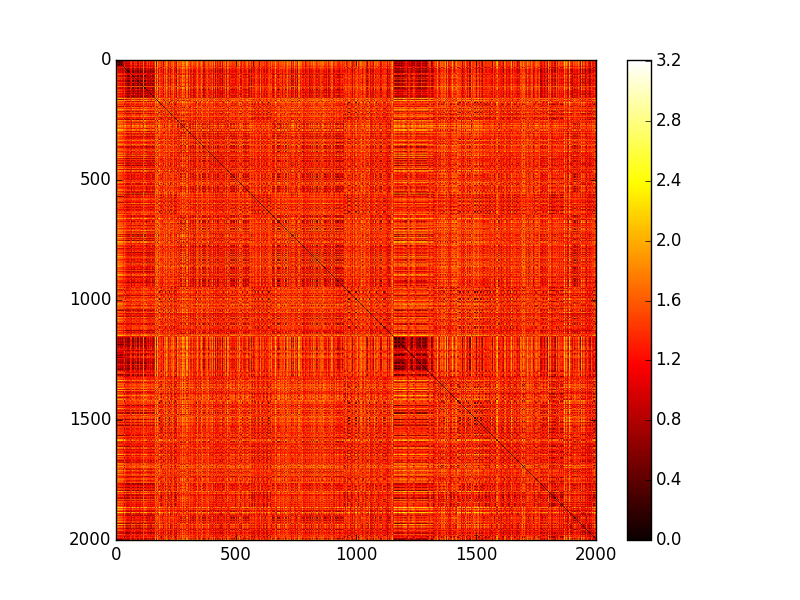
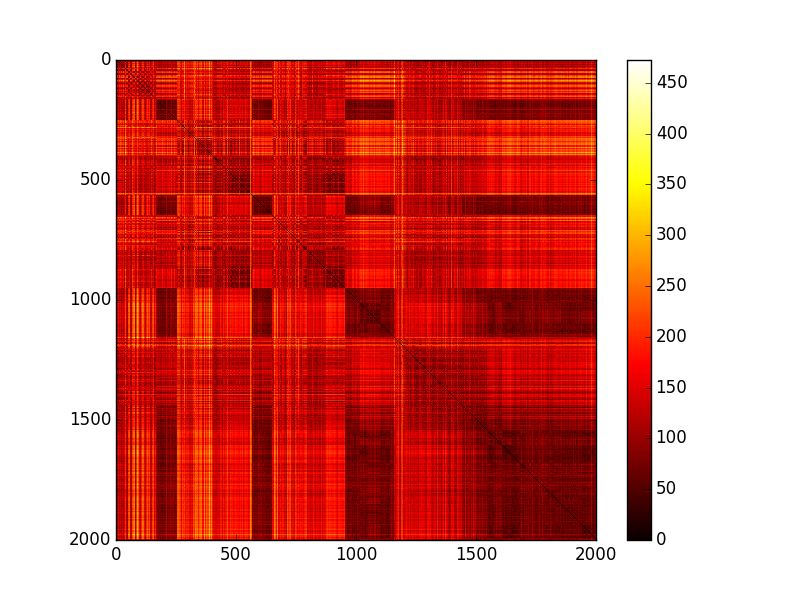

##Music Attributes Similarity Matrices:

Using the echoNest API to visualize the pitch and timbre similarity matrix as below for the song "lateralus.mp3" but it can be applied for any given mp3 file.

 

Figure 1: Pitch Similarity Matrix

Figure 2: Timbre Similarity Matrix
